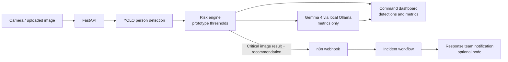
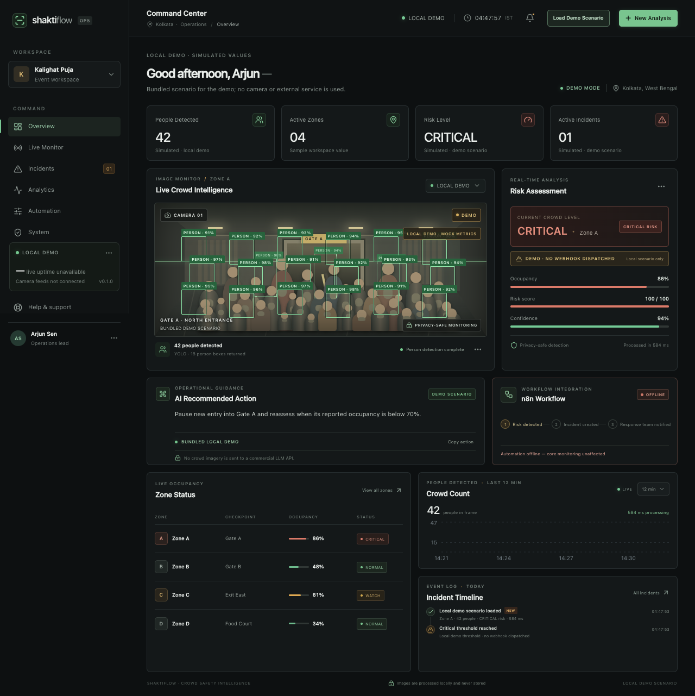

# ShaktiFlow

Privacy-preserving AI crowd intelligence that turns camera data into operational action.

ShaktiFlow is a hackathon MVP command center for image-based, anonymous person counting, prototype crowd-risk scoring, local operational recommendations, and optional n8n incident workflows. It is decision support for operators, not an emergency response or safety certification system.

## Problem

At busy public gatherings, operators may have limited time and visibility to notice crowd build-up across gates and shared areas. A slow or fragmented view can make it harder to decide when to meter entry or review a zone.

## Solution

An operator uploads a JPG or PNG image to the local FastAPI service. YOLO detects people without identifying them. A transparent, count-based prototype risk engine updates the dashboard; Gemma 4 can generate a concise recommendation locally through Ollama. A critical result can optionally trigger an n8n workflow.

## Demo Workflow

1. Start the Next.js dashboard. The initial sample workspace is clearly marked as simulated.
2. Select **Load Demo Scenario** to load one bundled critical scenario. Its values and recommendation are local mock data; this path needs no network, model download, backend, or Ollama.
3. To see real image analysis, start the backend and upload a JPG or PNG. The dashboard shows YOLO detections and updates the metrics.
4. If Ollama is running with `gemma4:e2b`, the backend requests a local recommendation. If it is unavailable, ShaktiFlow returns a deterministic rule-based recommendation.
5. If a critical real image result has an n8n production webhook configured, ShaktiFlow sends the metrics and recommendation. Demo data never dispatches a webhook.

## Why ShaktiFlow

- Turns a single image into a legible, operational summary.
- Keeps detection person-only: no facial recognition or identity matching.
- Runs recommendation inference locally instead of sending crowd metrics to a commercial LLM API.
- Makes its prototype thresholds and automation status visible to operators.
- Degrades gracefully when Ollama or n8n is unavailable.

## Architecture



The browser receives normalized bounding boxes and overlays them on the original preview. The backend decodes image bytes in memory and does not write uploads to disk. For the current MVP, image analysis and the local recommendation are separate API requests so YOLO metrics can appear first.

## Open-Source AI

ShaktiFlow uses openly available model software and weights that are downloaded separately; model files are not committed to this repository. “Open source” does not mean the project owns those models. Review each model and dependency's license before redistribution or deployment.

## Google Gemma Integration

Gemma 4 E2B runs through a local Ollama server at `http://localhost:11434`. The backend sends only numeric crowd metrics and the selected zone name to Ollama. No crowd image or detection boxes are sent to the language model. If the model is not installed, Ollama is offline, or generation fails, a deterministic local response is used.

The [Gemma 4 model card](https://ai.google.dev/gemma/docs/core/model_card_4) lists Gemma 4 under Apache 2.0. Gemma weights are not bundled here. Ollama and its model packaging have their own terms; consult their current notices.

## YOLO Computer Vision

The FastAPI service uses the Ultralytics `yolov8n.pt` pretrained model and keeps only the COCO `person` class. It does not identify people, perform facial recognition, or persist biometric data. The model weights are downloaded by Ultralytics when first needed and are not owned or redistributed by this project.

The [Ultralytics licensing page](https://www.ultralytics.com/license) describes AGPL-3.0 and its Enterprise License option. This repository is published under AGPL-3.0; review Ultralytics' current terms and all dependency/model licenses for your use case.

## n8n Automation

Set `N8N_WEBHOOK_URL` in `backend/.env` to an activated n8n production webhook. A successful 2xx response is shown as **CONNECTED** with a dispatch timestamp. Before a dispatch, the UI uses **STANDBY** for a configured URL; it does not imply reachability. If the URL is missing or a request fails, the UI reports `Automation offline — core monitoring unaffected`.

The starter workflow and setup walkthrough are in [`automation/`](automation/n8n-workflow.md). Optional Discord, Telegram, or Email credentials belong in n8n's credential manager and must not be committed here.

## Privacy by Design

- YOLO performs anonymous person detection only; no facial recognition is used.
- Images are held in memory for the MVP request and are not retained by the backend. The browser preview uses a temporary object URL that is revoked when replaced or unmounted.
- Gemma receives metrics and zone name only; it does not receive the image.
- No biometric or identity records are created.
- n8n receives only event metrics and recommendation text, not imagery.

These statements describe this prototype's code path. Operators deploying a modified or hosted version should review their full infrastructure, logging, and retention configuration.

## Tech Stack

- Next.js, React, TypeScript, and Tailwind CSS
- FastAPI and Pydantic
- Ultralytics YOLO and OpenCV
- Gemma 4 E2B through local Ollama
- n8n webhooks for optional workflow automation
- Recharts and lucide-react

## Local Setup

### Dashboard-only demo (works offline)

Node.js 20.9 or newer is required by the current Next.js release. The bundled demo does not require backend dependencies or model downloads.

```bash
git clone <repository-url>
cd shaktiflow
npm ci
cp .env.example .env.local
npm run dev
```

Open <http://localhost:3000> and select **Load Demo Scenario**. If your `.env.local` points to a running API, the Automation card reports its configured state; demo metrics still never trigger n8n.

### Full local analysis

Python 3.9 or newer is required. The YOLO weights download automatically the first time the backend starts with internet access. Install Ollama and pull Gemma once if you want local LLM recommendations; both are optional for the dashboard demo.

```bash
# Terminal 1: frontend
cd shaktiflow
npm ci
cp .env.example .env.local
npm run dev

# Terminal 2: backend
cd shaktiflow/backend
python3 -m venv .venv
source .venv/bin/activate
python -m pip install -r requirements.txt
cp .env.example .env
uvicorn app:app --reload --env-file .env --host 127.0.0.1 --port 8000

# Optional: local recommendation model, in another terminal
ollama serve
ollama pull gemma4:e2b
```

If the Ollama desktop app already owns port 11434, do not start a second `ollama serve`. To enable n8n, edit `backend/.env` and set `N8N_WEBHOOK_URL` to the production URL; leave it blank to keep automation offline. Never commit `.env` files.

## Screenshots



The screenshot shows the bundled local demo scenario; dashboard values and detection boxes are simulated.

## API Endpoints

Base URL: `http://localhost:8000`.

| Method | Path | Purpose |
| --- | --- | --- |
| `GET` | `/health` | Backend and YOLO model status |
| `GET` | `/automation/status` | Webhook configuration state; does not probe n8n |
| `POST` | `/analyze?normalized=true` | Upload JPG/PNG for person detection and crowd metrics (`multipart/form-data`, field `file`) |
| `POST` | `/recommend` | Generate local recommendation from people count, risk level/score, occupancy, and zone |
| `POST` | `/automation/dispatch` | Send a critical result and recommendation to the configured webhook |

Analysis returns `peopleCount`, `riskLevel`, `riskScore`, `occupancyPercent`, `confidence`, `processingMs`, `coordinatesNormalized`, and `detections` containing `x1`, `y1`, `x2`, `y2`, and `confidence`. With `normalized=true`, box coordinates are relative values from 0 to 1.

Webhook dispatch returns one of the following states:

```json
{"status":"dispatched","dispatchedAt":"2026-10-01T12:42:08+05:30","detail":null}
```

`dispatched` means the webhook returned an HTTP 2xx response. ShaktiFlow does not claim that optional downstream notifications were delivered or acknowledged.

Run backend checks with:

```bash
cd backend
source .venv/bin/activate
python test_backend.py
```

## Limitations

- The risk bands and occupancy percentage are prototype heuristics, not mathematically accurate physical crowd density or a safety certification. They must be calibrated for each venue and zone, including capacity and camera geometry, before any real-world use.
- The MVP analyzes one uploaded frame; it does not connect to live CCTV, track flow over time, account for camera blind spots, or fuse multiple cameras.
- Person detections can be missed or duplicated due to occlusion, image quality, camera angle, or model limitations.
- Gemma recommendations are decision support generated from supplied metrics and must be reviewed by trained operators.
- The frontend's sample overview and bundled demo are simulated; only an uploaded image runs YOLO.
- n8n integration is optional and only confirms webhook HTTP acceptance, not successful action by a response team.

## Future Work

- Venue-specific calibration and validation with operators
- Live camera ingestion with monitoring and retention controls
- Temporal crowd-flow analysis and multi-camera zone mapping
- Operational review, alert acknowledgement, and delivery confirmation
- Accessibility, localization, and broader field testing

## Team

Built by the ShaktiFlow team for the MLH Hacktoberfest hackathon. Add contributor names and profile links here before submission.

## License

ShaktiFlow is released under [GNU AGPL-3.0](LICENSE). Third-party packages, model weights, and assets retain their own licenses and notices. See the model sections above; this project does not claim ownership of YOLO or Gemma weights.
